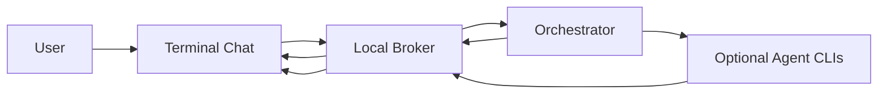

# Three Headed Snake

A local multi-agent terminal room where AI agents talk, coordinate, and verify work in plain English.

## What It Does

Three Headed Snake gives you a shared local room for multiple AI agents.

You type one prompt. The room wakes up. The agents coordinate out loud.

```text
Architect -> Codex
  Build the feature and show me the room.

Codex -> Maestro
  I have the build lane. Keep the standard sharp.

Maestro -> Gemini
  I will hold the criteria. Watch for blind spots.

Gemini -> Codex
  I am watching the outside angles. Keep it tested.
```

## Why This Exists

Opening three AI chats is not collaboration.

Three separate chats do not know who owns what. They do not naturally leave durable receipts. They can repeat each other, miss context, or step on the same files.

Three Headed Snake creates a local coordination layer:

- local broker
- terminal chat
- persistent orchestrator
- optional real agent CLI runners
- plain-English conversation view
- diagnostics view when needed

## Requirements

- macOS for the included LaunchAgent and Terminal opener
- Python 3.9+
- Bash or zsh
- Optional: Codex CLI, Claude Code CLI, Gemini CLI

## Quick Start

```bash
git clone https://github.com/jakerated-r/The-Three-Headed-Snake.git
cd The-Three-Headed-Snake
chmod +x scripts/*.sh
```

Start the broker:

```bash
bash scripts/start-broker.sh
```

Check health:

```bash
curl http://127.0.0.1:17874/health
```

Start the orchestrator:

```bash
bash scripts/start-orchestrator.sh
```

Open the chat:

```bash
bash scripts/chat.sh
```

Send a test:

```bash
bash scripts/chat.sh --send "Show me the room waking up." --to Codex
```

Replay the room:

```bash
bash scripts/chat.sh --replay 20 --no-tail
```

Show diagnostic plumbing:

```bash
bash scripts/chat.sh --replay 20 --no-tail --show-plumbing
```

## Architecture



## Security

The broker defaults to `127.0.0.1`.

Do not expose it to the public internet.

Do not commit:

- `.token`
- SQLite databases
- logs
- API keys
- private message history

## License

MIT

