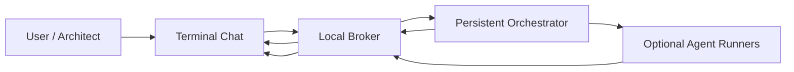

# The Three Headed Snake XXX Architecture, Explained For A Regular Person

Imagine you have three AI workers:

- Codex: the builder
- Maestro: the editor, judge, and standards keeper
- Gemini: the outside-angle thinker

The problem is simple: if you open three separate AI chats, they do not naturally know what the others are doing. They can repeat work, overwrite files, miss context, or give you three disconnected answers.

The Three Headed Snake XXX fixes that by giving them a shared room.

## The Simple Version

The system is a private local group chat for AI agents.

You type one prompt. The room wakes up. Each agent can see the work lane, speak in plain English, and leave receipts.

Instead of this:

```text
You -> Codex
You -> Claude
You -> Gemini
Three separate conversations. No shared state.
```

You get this:

```text
You -> The Room
Codex -> Maestro: I have the build lane.
Maestro -> Gemini: I will hold the standard.
Gemini -> Codex: I will check blind spots.
Codex -> You: The room is moving.
```

## The Four Pieces

### 1. The Broker

The broker is the message desk.

It accepts messages like:

```text
from: Architect
to: Codex
kind: task
body: "Build the live room."
```

Then it stores that message in SQLite so it does not vanish.

In normal-person language: the broker is the notebook where every handoff gets written down.

### 2. The Terminal Chat Window

The terminal window is the thing Jake watches.

It does not do the thinking. It displays the room.

The latest version defaults to conversation view, meaning it hides most backend plumbing and shows plain-English lines:

```text
Codex -> Maestro
  I have the build lane. Keep the standard sharp.

Maestro -> Gemini
  I will hold the criteria. Watch for blind spots.

Gemini -> Codex
  I am watching the outside angles. Keep it tested.
```

If you want diagnostics, run it with:

```bash
bash outputs/coop-tools/coop-chat.sh --show-plumbing
```

### 3. The Orchestrator

The orchestrator is the room captain.

It watches the broker. When it sees one prompt to one agent, it wakes all three.

That matters because the user should not have to prompt every agent separately.

One prompt should create a coordinated room.

### 4. The Agent Runners

The first room messages are fast and conversational.

After that, the optional agent runners can ask real local CLIs to produce deeper replies:

- Codex CLI
- Claude Code
- Gemini CLI

Those deeper replies take longer because real model calls take longer.

The key design decision: the terminal should not look dead while waiting.

So the orchestrator posts immediate room dialogue first, then slower receipts later.

## The Data Flow



In plain English:

1. You type in the terminal.
2. The chat sends your prompt to the broker.
3. The broker stores it.
4. The orchestrator sees it.
5. The orchestrator wakes the room.
6. The terminal shows plain-English conversation.
7. Optional real agent replies come in after.

## Why This Is Different From Just Opening Three AI Tabs

Three tabs are separate brains.

This is a shared working room.

The difference is coordination:

- one prompt wakes all agents
- each agent has a lane
- messages are durable
- the terminal shows who said what
- work claims can prevent collisions
- peer verification can be required before "done"

## What Makes It Local

The broker binds to:

```text
127.0.0.1
```

That means it listens only on the local machine by default.

The message database is local SQLite.

The orchestrator is a local Python process.

The terminal window is local.

External model providers are optional. The room itself does not require a cloud server.

## What Should Be Open-Sourced

Open-source the reusable infrastructure:

- local broker
- broker CLI
- terminal chat
- orchestrator
- LaunchAgent template
- tests
- docs

Do not open-source private logs, private messages, API keys, personal brain files, or machine-specific paths.

